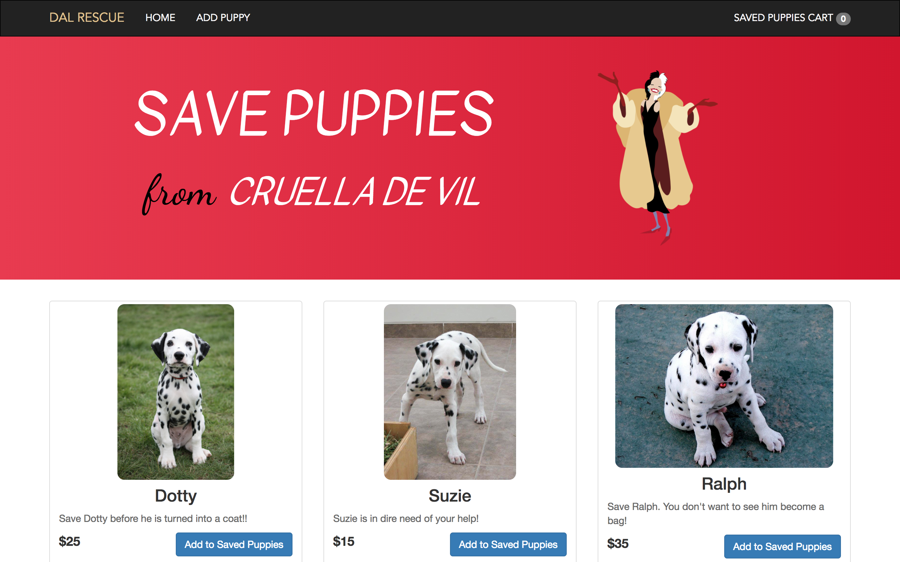
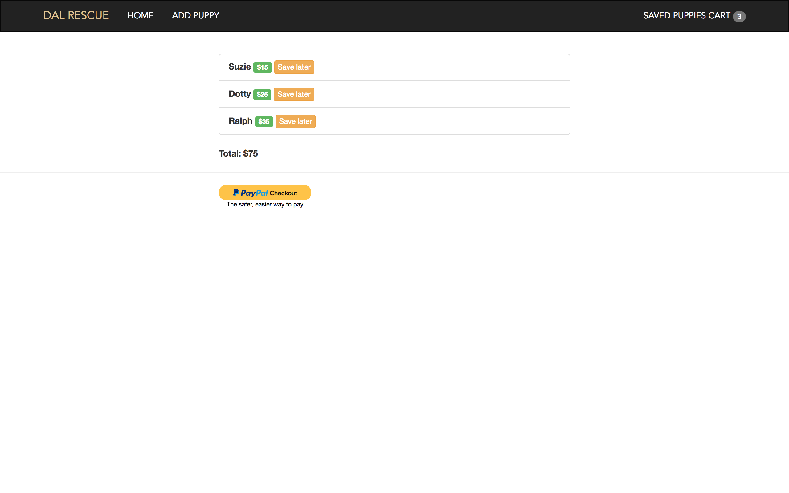

# dalmatian-rescue
An e-commerce web app in which products are Dalmatian puppies that users can rescue from Cruella De Vil. Built using Node.js, Express, MongoDB, and the PayPal Rest Node SDK

# Home Page 

# Shopping Cart and Checkout page

# Notes and Credits 
- client id and secret are removed

Photo Credits: 
Dotty: https://www.flickr.com/photos/alizzia13/4573769838
Suzie: https://commons.wikimedia.org/wiki/File:Dalmatian_puppy.JPG
Ralph: https://www.flickr.com/photos/wwwpgflickrcom/2089047447/
Cruella De Vil: https://pixabay.com/en/cruella-de-ville-cruella-de-ville-2267126/
